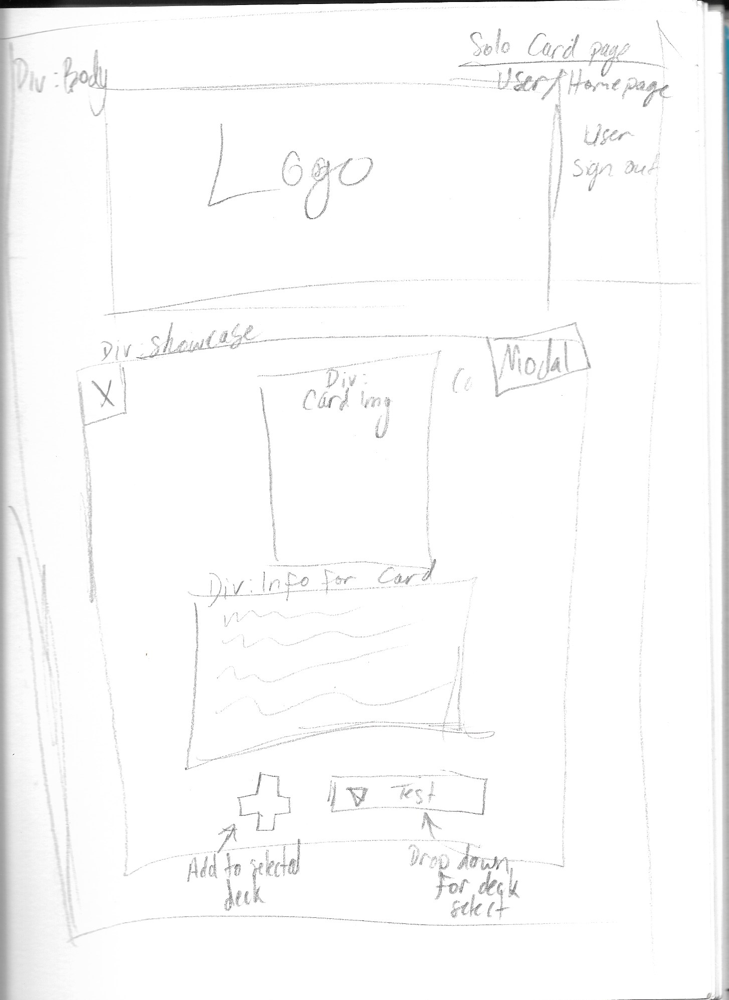

# -DeckMaster- [PROTOTYPE]
The purpose of -DeckMaster- is to assist the user in building and tracking trading card decks.

### Links
- https://github.com/ahkiemcm/deckmaster [GitHub]
- https://trello.com/b/5r8ZrohV/x-project-3-deckmaster [Trello-Board]
- https://deck-master.herokuapp.com/ [Heroku-Site]

## WireFrames

## ERD

## Technologies Used
Front-End
- React.js
- Styled-Components
- Axios
- React-router-dom

Back-End
- Express.js
- Node.js
- MongoDB / Mongoose

   

## Remarks
Some features of this applications are still in development and will be updated as soon as possible. 

